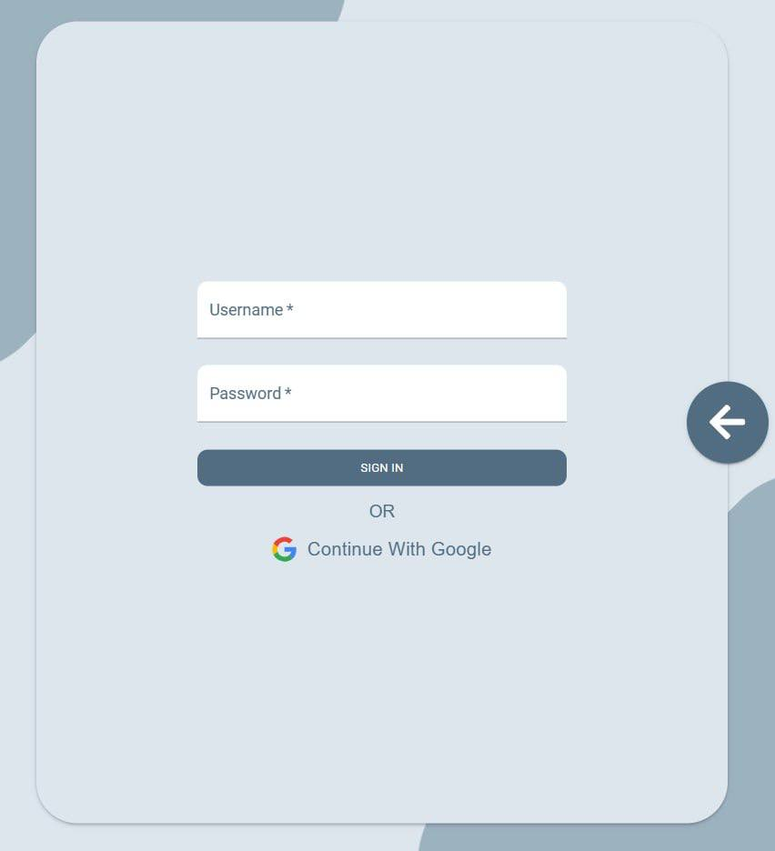
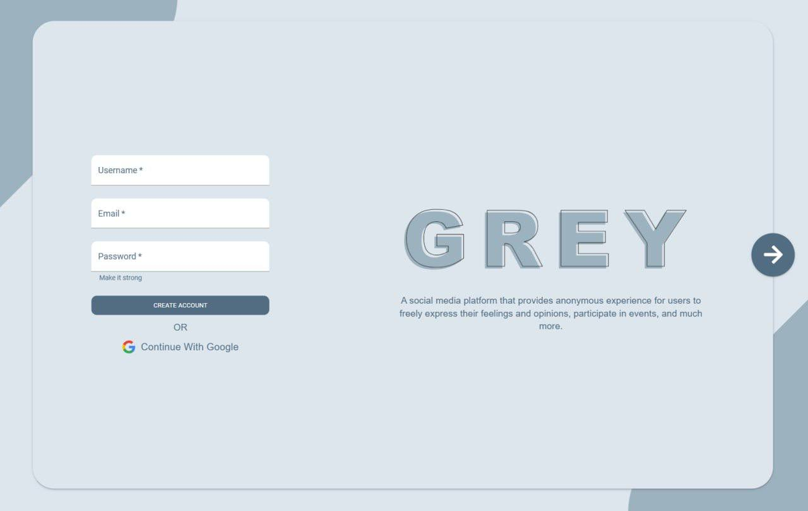
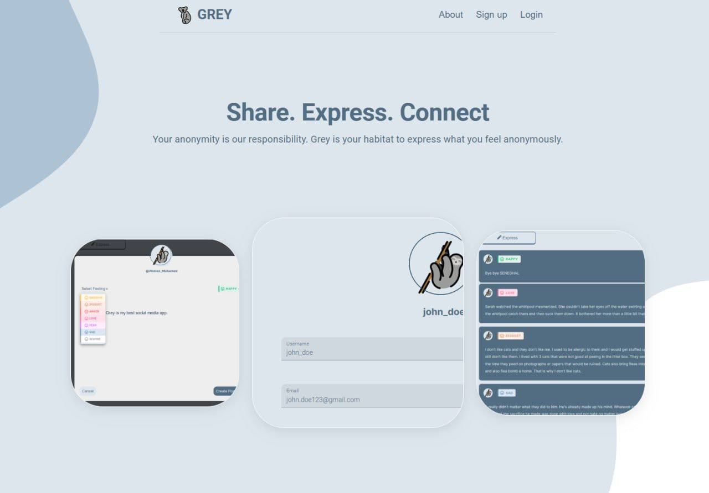
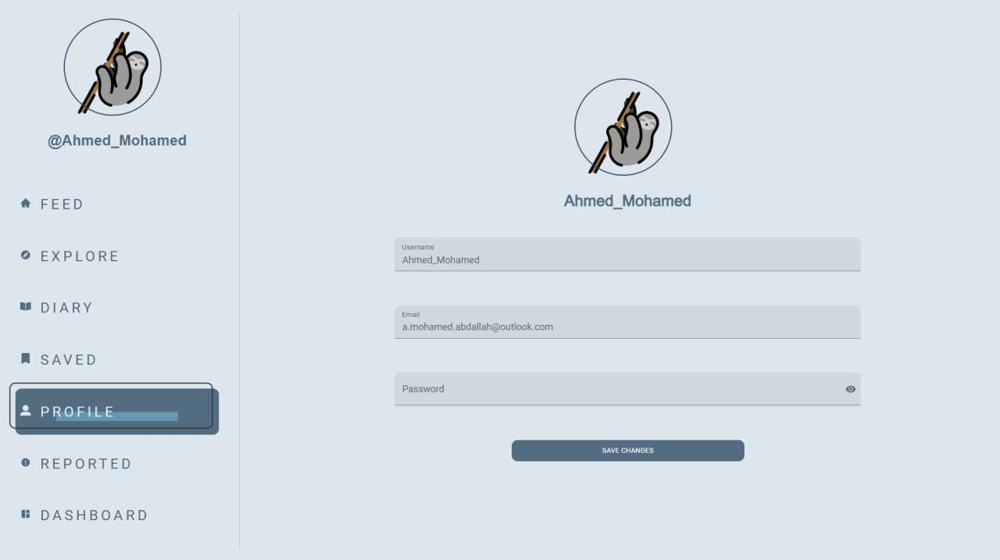
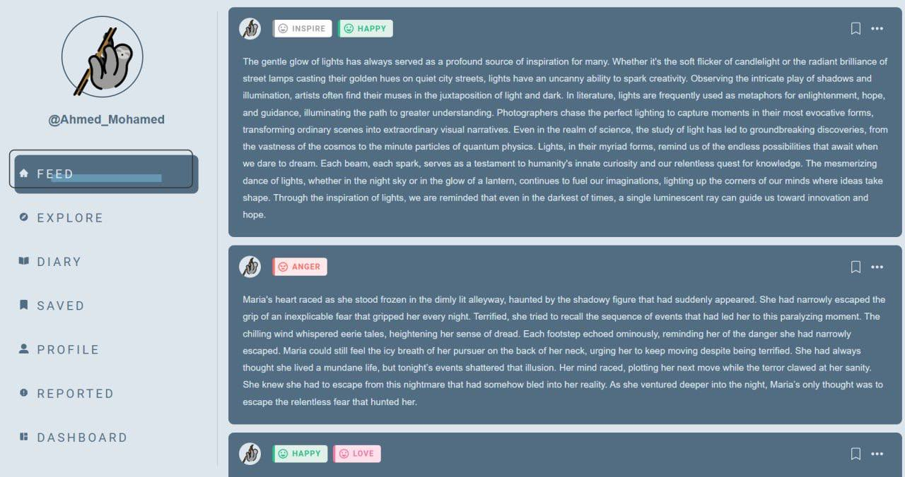
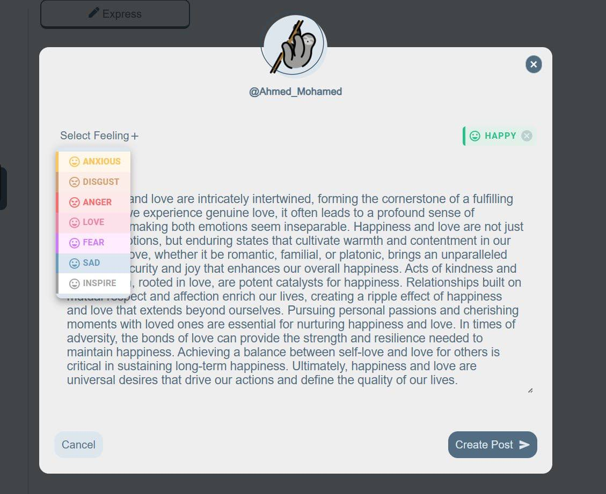
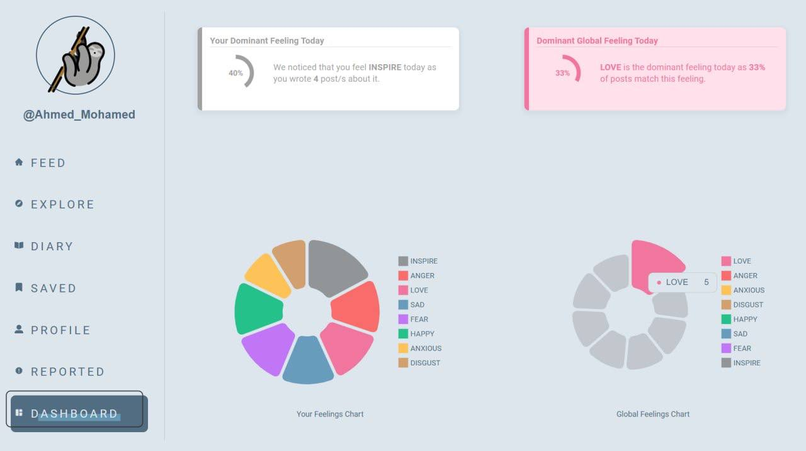

# Grey

Grey is an anonymous-first social media web application designed to limit excessive usage and promote healthier online interaction. The platform removes identity-driven pressure and infinite engagement loops, allowing users to focus on expression and discussion rather than profiles, followers, or validation metrics.

## Overview

Modern social media platforms optimize for maximum engagement, often encouraging addictive behaviors and identity-based comparison. Grey takes a different approach by combining anonymity with intentional usage constraints to create a calmer, more thoughtful social experience.

Users can post and interact without revealing personal identity, while built-in limits reduce endless scrolling and encourage mindful participation.

## Core Principles

- Anonymity over identity
- Limited usage over infinite engagement
- Content-driven interaction over social metrics
- Simplicity and clarity over algorithmic feeds

## Features

- Anonymous posting and interaction
- Usage and time-limiting mechanisms
- Minimal, distraction-free social feed
- Focus on discussion rather than popularity
- Scalable web architecture

## Goals

- Reduce social media addiction patterns
- Encourage honest and low-pressure expression
- Provide a space for ideas without identity bias
- Explore alternative social network design

## Technology

- Backend: Java-based server architecture
- Frontend: Modern web stack (TypeScript, CSS)
- Designed with modularity and scalability in mind

## Status

Grey is an experimental project exploring healthier social media models and alternative interaction paradigms.

  
  
  

  
  
  

  

